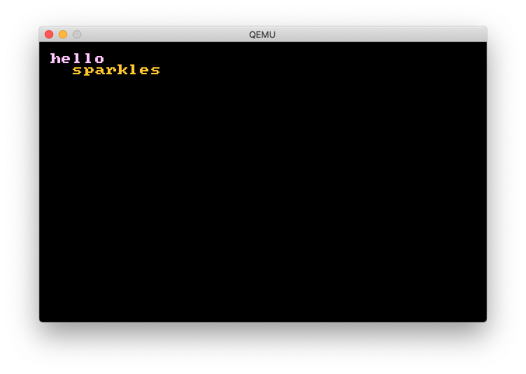

# sparkleOS ✨

right now this is just a simple "hello world" bootloader that stays in real mode



## requirements

nasm - to compile

```
brew install nasm
```

qemu - to emulate

```
brew install qemu
```

## compile

```
make
```

## run on qemu

```
make run
```

## make a bootable usb disk

TBD using fdisk/dd

# what to dooooo next

* [ ] protected mode
* [ ] long mode
* …
* [ ] kernel? video?? we'll see
